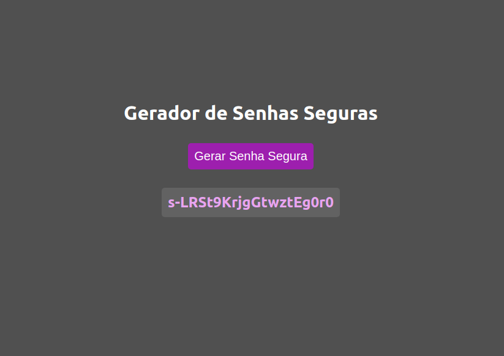

# Gerador de Senhas 

Foi criado o melhor e mais maravilhoso gerador de senhas do mundo.
 - cosumido o uso de Api NanoId para geração de chaves seguras.
 - Instalado Eslint 
  


## Authors

- [@BrunoSouzaFarias](https://github.com/BrunoSouzaFarias)


## Features

- Gerador de Senhas
- JavaScript
- Node.js
- Vite
- Clipboard-copy


## Screenshots




## Installation

Install gerador-de-senhas com npm

```bash
  npm install vite
  npm run dev
```
    